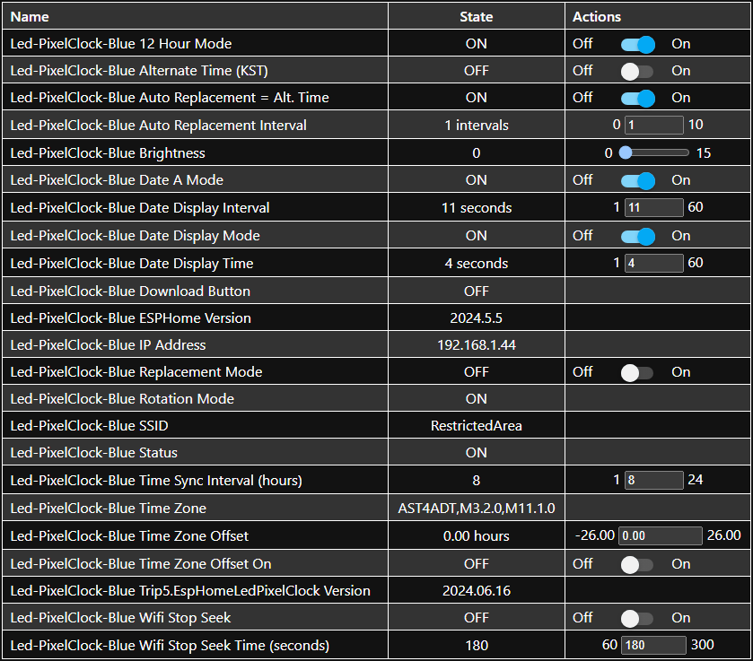

# EspHome-Led-PixelClock

EHLPC is meant to be used on ESP-based MAX7219 Digit Display Clocks using ESPHome. So far, it works with an un-named Aliexpress Clock. It can probably be adapted for use with other MAX7219 Digit clocks. And, of course, it's ESPHome, so it's only limited by your imagination and skill.

A lot of inspiration is taken from the [`EHMTXv2`](https://github.com/lubeda/EspHoMaTriXv2) project... but with a monochrome LED Display.

Using this clock requires external font files.  I prefer my own [`MatrixClockFonts`](https://github.com/trip5/MatrixClockFonts) but ESPHome supports a variety of [`fonts`](https://esphome.io/components/display/index.html#fonts), including TTF.

For now, the file [`EHLPClock.yaml`](EHLPClock.yaml) contains the full YAML code, including a lengthy lambda that makes it all work.  At some point, I may turn this into a custom component for ESPHome... but for now, you'll just to have carefully edit the YAML to suit your needs.

## Dot Matrix Clock


This is the link on Aliexpress I have personally used but I am sure there are others:
https://www.aliexpress.com/item/1005005704533418.html

Here is my clock, using the Matrix Font and a bit of paper sandwiched between the LED display and the acrylic.


### Flashing

Flashing is dead-simple. Hold the 'Download' button while powering-on the clock or by pressing the reset button.

## Using This firmware

This is ESPHome, so it's not pretty but very functional.  You should set your wifi information in the YAML and edit it carefully.

If using this device on a network outside your usual, ESPHome will, after 30 seconds, give up trying to connect to its "home" network and enter AP mode.
You should then connect to the hotspot (with a mobile phone) and then go to 192.168.4.1 in a browser to select which local wifi network you would like it to connect to.
The clock will display its IP address on boot and also by holding down the set button for more than 1 second. When returning home, you will have to go through this process again.
Be sure if you are using this clock as a travel clock to NOT use Home Assistant as a time source (it doesn't by default anyways).

### Screenshot

Ideally, this would look a lot prettier than it does but there's not a lot I can with the default ESPHome WebUI.



### Button Functions

There's only one useable button on this clock but thanks to multi-click, we can use it for a few functions.

| Download Button     | Functionality          |
| ------------------- | ---------------------- |
| Short-click         | Show last message for 10 seconds |
| Double-click        | Toggle 12/24-hour mode |
| Long-press 1 second | Show the clock's IP address |

Of course, this is ESPHome, so you can change the button functions by editing the YAML.

### Rotation Sensor

This clock has a rotation sensor. It seems to be just a mercury-like bulb that detects if the clock has been flipped. This is functional to flip the clock but you could also use it for other things if you wish.

### Date Display

This clock can display the date at configurable intervals.  The display interval checks how long the clock was displayed for and then displays the date for the specified time
(in seconds).  Keep in mind that displaying the message from the Home Assistant integration will not interrupt this count, so I recommend choosing sane and even numbers.

## Integration with Home Assistant


This example will send a message that will display for 3 seconds before reverting to the clock for 5 seconds, and repeat until 20 seconds is finished (if it is displaying the message, it will finish that last 3 seconds).

## Tasmota Notes

Some people would prefer to use Tasmota.  I did use Tasmota at first but I found it a bit lacking, namely that it doesn't seem possible to replace the default font.  I made some notes that I'll include here:

First, using [`Gitpod`](https://gitpod.io/#https://github.com/arendst/Tasmota/tree/master), add these lines to user_config_override.h:
````
#define USE_DISPLAY_MAX7219_MATRIX
#define USE_I2C
#define USE_DS3231
#define USE_RTC_CHIPS
````

Then run:
````
platformio run -e tasmota-display
````

The GPIOs:
| Function | PIN  |
| -------- | ---- |
| SCL  | GPIO4  |
| SDA  | GPIO5  |
| CLK  | GPIO14 |
| MOSI | GPIO13 |
| CS   | GPIO15 |
| LEDLINK | GPIO2 |
| SWITCH 1 (Download button) | GPIO0 |
| SWITCH 2 (Rotation Sensor) | GPIO16 |

Some useful console commands (it'll at least get you a functional display, though you may need to reset the power first):
````
Backlog DisplayWidth 32; DisplayHeight 8; DisplayModel 19; DisplayMode 0; DisplayRotate 1

Backlog Power 1; DisplayClock 1
````

## Useful Links

What started my curiousity (a long discussion on ESP-based 7-segment clocks): https://github.com/arendst/Tasmota/discussions/15788

Trombik's ESPHome Component for the DS1302 RTC (used on the 303): https://github.com/trombik/esphome-component-ds1302

About outputting to the MAX7219 Digit Display: https://esphome.io/components/display/max7219digit.html

ESPHome's Display: https://esphome.io/components/display/index.html

