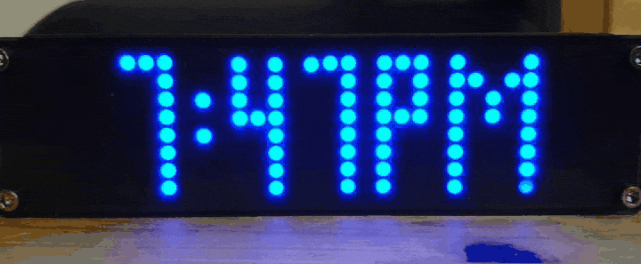
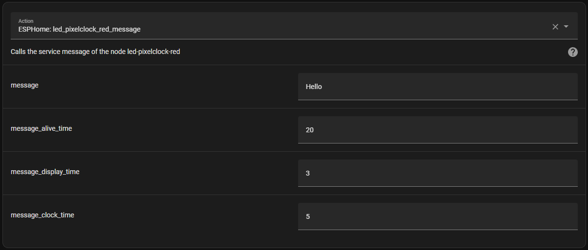

# EspHome-Led-PixelClock

EHLPC is meant to be used on ESP-based MAX7219 Digit Display Clocks using ESPHome. So far, it works with an un-named Aliexpress Clock. It can probably be adapted for use with other MAX7219 Digit clocks. And, of course, it's ESPHome, so it's only limited by your imagination and skill.

A lot of inspiration is taken from the [`EHMTXv2`](https://github.com/lubeda/EspHoMaTriXv2) project... but with a monochrome LED Display.

Using this clock requires external font files.  I prefer my own [`MatrixClockFonts`](https://github.com/trip5/MatrixClockFonts) but ESPHome supports a variety of [`fonts`](https://esphome.io/components/display/index.html#fonts), including TTF.

Due to memory constraints on the ESP8266 these clocks use, I've decided to split the functions by how you may choose to use the clock.  Read below for more details.

#### Note: ESPHome must be version 2023.11.0 or higher!

## Dot Matrix Clock


Here are a few links on Aliexpress I have personally used but I am sure there are others:
https://www.aliexpress.com/item/1005006038630745.html & https://www.aliexpress.com/item/1005005704533418.html & https://www.aliexpress.com/item/1005006085818026.html

Here is my clock, using the Matrix Font and a bit of paper sandwiched between the LED display and the acrylic (the larger screens are a bit bright).


### Flashing

Flashing is dead-simple. Hold the 'Download' button while powering-on the clock or by pressing the reset button.

## Using This firmware

This is ESPHome, so it's not pretty but very functional.  You should set your wifi information in the YAML and edit it carefully.

If using this device on a network outside your usual, ESPHome will, after 10 seconds (set by the YAML), give up trying to connect to its "home" network and enter AP mode.
You should then connect to the hotspot (with a mobile phone) and then go to 192.168.4.1 in a browser to select which local wifi network you would like it to connect to.
The clock will display its IP address on boot and also by holding down the set button for more than 1 second. When returning home, you will have to go through this process again.
Be sure if you are using this clock as a travel clock to NOT use Home Assistant as a time source (it doesn't by default anyways).

There does appear to be some errors with "Component preferences took a long time for an operation" but it only happens when saving persistent variables to flash and doesn't seem to affect functionality, unless you try to change a variable during this moment.

### Screenshot

Ideally, this would look a lot prettier than it does but there's not a lot I can with the default ESPHome WebUI.


### Button Functions

There's only one useable button on this clock but thanks to multi-click, we can use it for a few functions.

| Download Button      | Functionality                   | HA Version        |
| -------------------- | ------------------------------- | ------------------|
| Short-click          | Toggle date display mode on/off | Same              |
| Double-click         | Toggle 12/24-hour mode on/off   | Same              |
| Short-click, long-press | Toggle Time Zone Offset on/off (or Alt Time Zone) | Toggle Alt Time Zone |
| Long-press 2 seconds  | Show the clock's IP address (or other wifi status) | Toggle Time/Date Text Replacement |
| Long-press 5 seconds | Toggle the Wifi Stop Seek on/off (see below) | Toggle Auto Replacement = Alt. Time |

Of course, this is ESPHome, so you can change the button functions by editing the YAML if you wish.

### Rotation Sensor

This clock has a rotation sensor. It seems to be just a mercury-like bulb that detects if the clock has been flipped.
This is functional to flip the clock but you could also use it for other things if you wish.

### Date Display

The clock can display the date at configurable intervals.
The display interval checks how long the clock was displayed for and then displays the date for the specified time (in seconds).
Keep in mind that displaying the message from the Home Assistant integration will not interrupt this count, so I recommend choosing sane and even numbers.

### Alternate Time Zone

This option is to allow displaying a Time Zone other than your "home" time zone.  It can be activated permanently or by using the "Auto Replacement = Alt. Time" mode.
This allows you to see your home time zone and an alternate time zone in another language.  Now your clock is a bilingual time-traveler!

Please note that the time zones MUST be in POSIX format instead of the usual Olsen type (`Asia/Seoul`).

POSIX formats look like: `KST-9` or `PST8PDT,M3.2.0/2:00:00,M11.1.0/2:00:00` or `AST4ADT,M3.2.0,M11.1.0`.

They include daylight savings and time-switches in the formatting. So, there is no reliance on the ESPHome Olsen database to be current.
You can view a lot of the time zones in the world in POSIX format [`here`](https://gist.github.com/alwynallan/24d96091655391107939).
If you need to make a custom POSIX format you can look [`here`](https://developer.ibm.com/articles/au-aix-posix/).

### Time/Date Text Replacement

Since ESPHome can't seem to use any locale for time other than English, I have added an option to substitute the time and date text to something else.
In the text_sensors section, you can find filters that allow substitutions.

In my YAML, you will see those filters are able to localize time into Korean Hangul.  You can change this to anything you like.
Be sure that the text to be substituted matches the output of strftime (which will be the default) and be sure to make sure any characters you need are included in the glyphs section,
or those special characters will not be displayed!

There is also an option called Replacement Interval by which you can make your clock bilingual. It will automatically turn on/off the substitution every number of times the date is displayed, if the date is displayed.  If the date display is off, the automatic replacement will be made after the time specified by Date Display Time (multiplied by the Date Display Interval).



Check the language_filters folder for some examples.  So far there is:
[`Korean`](language_filters/Korean.yaml) &
[`French`](language_filters/French.yaml) &
[`Greek`](language_filters/Greek.yaml) &
[`Chinese`](language_filters/Chinese.yaml)

Hopefully this OnlineGDB hosts the [`Glyphs Helper`](https://www.onlinegdb.com/fork/zh1VszNT1) for a long while.

### Time Sync

Time can be synced to the Internet at configurable intervals between 1 - 24 hours, provided the wifi network is connected.

## Non-HA Version

The file [`EHLPClock.yaml`](EHLPClock.yaml) contains functions useful for using the clock as... mostly just a clock but with some power-saving functions.

### Time Zone Offset

It's up to you how to handle time offset.  It will affect the main time zone as well as the alternate time zone
You can set an offset with a number that is a positive or negative value with decimal places (ie. 2, -2, 12.5).

I have allowed steps of 0.25 (equal to 15 minutes) but I notice ESPHome does not enforce those steps. It is possible to set an offset like 0.01 (which would be 36 seconds).
Be careful.

### Wifi Stop Seek

This is disabled by default but by turning it on, the clock will disable its wifi radio after a configurable time if the network connection is dropped.
Note that this does not turn wifi off if connected, it's merely a timeout for when the configured wifi connection cannot be made. 
This is meant as a power-saving feature in the event of a power blackout.

Under normal conditions, when an ESPHome device loses wifi connectivity, it will continuously seek out a wifi connection or activate a hotspot to allow configuring a wifi connection.
While in this non-connected state, the clock will use more power than usual. If you have a coin-cell battery that maintains the RTC during a blackout,
you could re-connect the clock to a powerbank or some other power source and it will continue to function.

Please note that this also means that the clock will not try to connect to wifi again (this will be indicated on the screen as "Wifi Off" when long-pressing the button),
unless you reset the power, which just means unplugging it and plugging it back in again.

Do not set this time too short.  I have allowed 60 seconds minimum in the options but this could mean your clock stops trying to connect to wifi just because
your router rebooted or the wifi was a bit sketchy. The default is 120 seconds which I think is enough time for even the slowest router to reboot, but it's your choice.
Also keep in mind that this time will affect how long the configuration hotspot is available for.
The hotspot will activate after 10 seconds (lowered from 60 seconds which is ESPHome default).

You can enable or disable this mode by holding the button for 5 seconds to toggle the function. The wifi will be turned on again if it has been turned off.

#### Power Consumption (measured with Large Blue LED Clock, 2023.11.16 Version)

| Status / Mode           | Power usage (24 hours) |
| ----------------------- | ---------------------- |
| Connected               | 3000 mAh               |
| Stop Seek Off & No Wifi | 3200 mAh               |
| Stop Seek On & Wifi Off | 1600 mAh               |

### LED Output

While the clock is connecting to wifi or while in hotspot mode, the blue LED will pulse on and off. In regular mode, the LED will turn on or off will be every 1 second.
If Stop Seek is enabled, the led will pulse on or off every 2 seconds. If connected to Wifi or Stop Seek (as above) is active, the LED will turn off completely.

## Home Assistant Version

The file [`EHLPClock-HA.yaml`](EHLPClock-HA.yaml) contains functions useful for using the clock with Home Assistant.

### Service Call



This example will send a message that will display for 3 seconds before reverting to the clock for 3 seconds, and repeat until 20 seconds is finished (if it is displaying the message, it will finish that last 3 seconds). It may interrupt any screen currently being displayed and will return to it after the display time is finished, show the clock/date screen for the specified time, and repeat until the alive time is finished (which includes both the service screen and clock/date screens).  Everything is measured in seconds.

### Home Assistant Configuration

This will allow the clock to display information screens, following a single interval of clock and date screens.  You can display all screens at once or one per interval.
They are all treated as sensors, similarly as my [ESPHome-eInk-Boards](https://github.com/trip5/ESPHome-eInk-Boards) projects.

Put something like this in your `configuration.yaml`:

```
template: !include template.yaml
```

Anything in `configuration.yaml` under the `template:` heading must now be moved to `template.yaml`. Take a quick look [here](https://community.home-assistant.io/t/how-do-i-setup-template-trigger-sensor-in-a-splitting-config/718626/) for some examples on an easy way to format `template.yaml`.

The file [`template.yaml`](template.yaml) contains several examples how to add sensors that can be automatically shown by the clock.
I personally use only one sensor in my Home Assistant and 2 clocks in the house get data from the same sensor but you can (of course) create a sensor for each indivudal clock.

## Crashes?

The memory of the ESP8266 on this clock is extremely limited. With these default yamls, I've found the devices often crash just when doing an OTA update.
So I usually flash via USB cable.  To save memory, it is probably a good idea to limit the number of characters you include in the glyphs section to only necessary characters.

If your clock is constantly crashing, you can first try eliminating the message_font (read the notes in the yaml). 
Then, add this to you sensor section and check how much free memory the ESP has to work with.

````
sensor:
  - platform: template
    name: "ESP Free Heap"
    lambda: |-
      int heap = ESP.getFreeHeap();
      return heap / 1024.0;
    unit_of_measurement: "kB"
    update_interval: 5s
    entity_category: diagnostic
    icon: mdi:chip
````
I've found anything below 8kB available to the heap can cause constant crashes.

## Update History

| Date       | Release Notes    |
| ---------- | ---------------- |
| 2024.06.16 | Added Home Assistant version, major changes to main version, fixed time sync error |
| 2024.06.09 | Replacement Interval fix |
| 2024.01.07 | Time/Date Text Replacement |
| 2023.11.16 | Wifi Stop Seek, 2nd date screen, time zone offset, alt time zone |
| 2023.10.22 | Show date on intervals |
| 2023.09.10 | Basic functionality, HA integration, rotation |

## Tasmota Notes

Some people would prefer to use Tasmota.  I did use Tasmota at first but I found it a bit lacking, namely that it doesn't seem possible to replace the default font.  I made some notes that I'll include here:

First, using [`Gitpod`](https://gitpod.io/#https://github.com/arendst/Tasmota/tree/master), add these lines to user_config_override.h:
````
#define USE_DISPLAY_MAX7219_MATRIX
#define USE_I2C
#define USE_DS3231
#define USE_RTC_CHIPS
````

Then run:
````
platformio run -e tasmota-display
````

The GPIOs:
| Function | PIN  |
| -------- | ---- |
| SCL  | GPIO4  |
| SDA  | GPIO5  |
| CLK  | GPIO14 |
| MOSI | GPIO13 |
| CS   | GPIO15 |
| LEDLINK | GPIO2 |
| SWITCH 1 (Download button) | GPIO0 |
| SWITCH 2 (Rotation Sensor) | GPIO16 |

Some useful console commands (it'll at least get you a functional display, though you may need to reset the power first):
````
Backlog DisplayWidth 32; DisplayHeight 8; DisplayModel 19; DisplayMode 0; DisplayRotate 1

Backlog Power 1; DisplayClock 1
````

## Useful Links

What started my curiousity (a long discussion on ESP-based 7-segment clocks): https://github.com/arendst/Tasmota/discussions/15788

Trombik's ESPHome Component for the DS1302 RTC (used on the 303): https://github.com/trombik/esphome-component-ds1302

About outputting to the MAX7219 Digit Display: https://esphome.io/components/display/max7219digit.html

ESPHome's Display: https://esphome.io/components/display/index.html

The original creator if this clock (unsure if the Chinese Manufacturer appears to be related): https://www.youtube.com/@hacklabs

